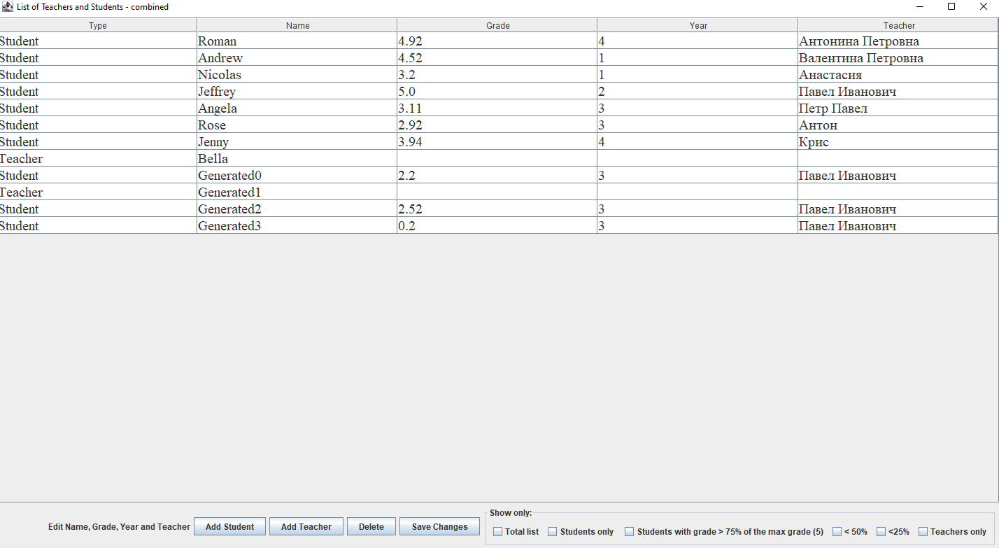
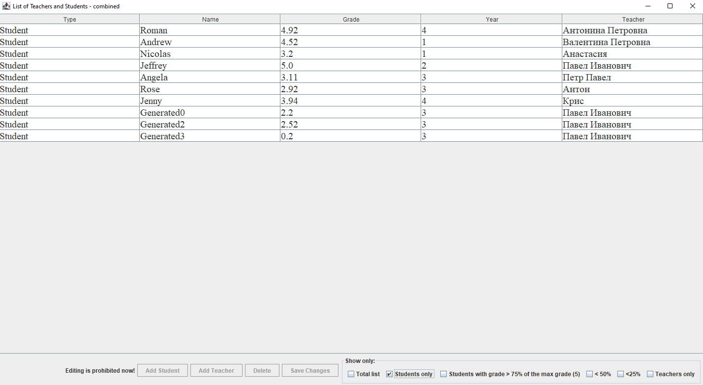
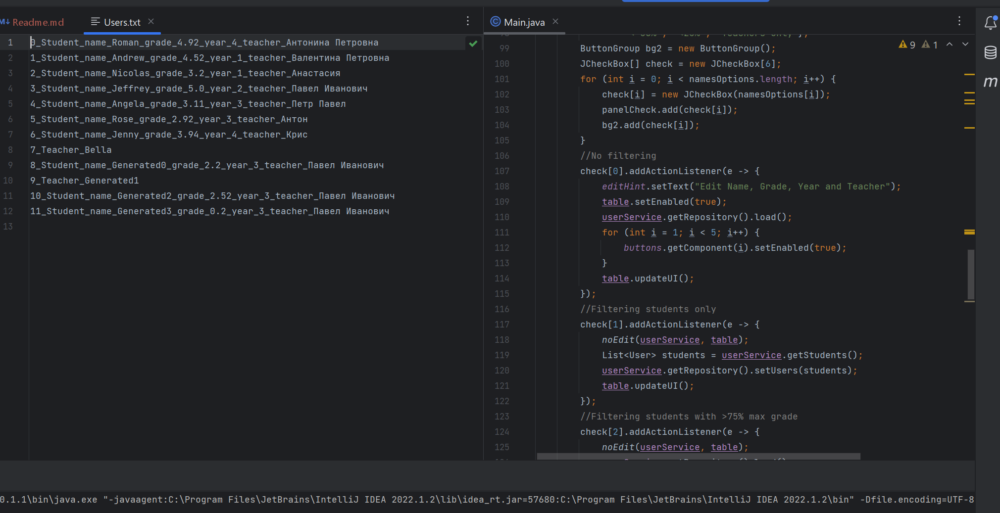

### MVC Swing and Stream API
A project, demonstrating the use of Swing:
- JTable to show a collection of Students and Teachers, stored in a txt

- The JTable contains buttons to add new positions
- The table has various editing settings depending the object (Teacher / Student) structure

- Additional checkboxes provide sorting (Stream API in code)

